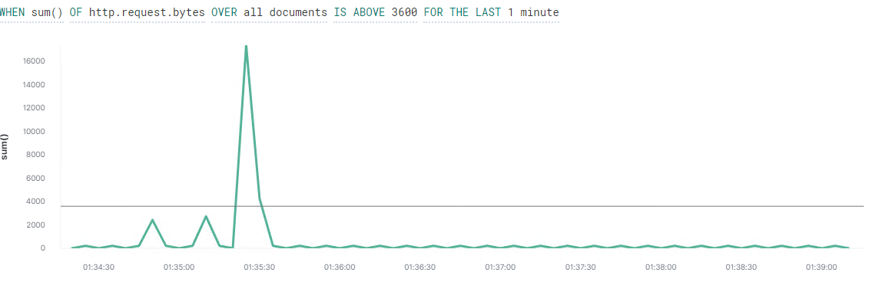
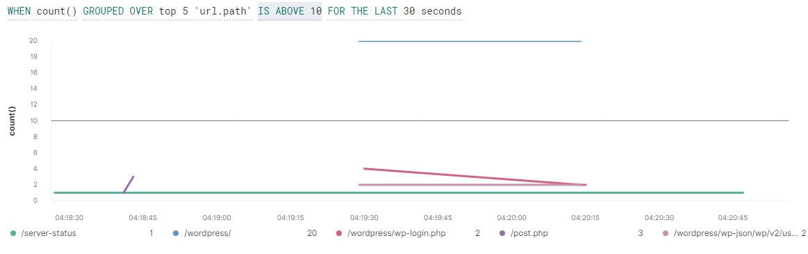

# Blue Team: Summary of Operations

This document reports the reaction of the current alerts to the attack and suggests new alerts and system hardening for a more robust defensive strategy.

## Table of Contents
- Network Topology
  - Description of Targets
- Monitoring the Targets
- Patterns of Traffic and Behaviour
- System Hardening, Mitigation Proposals and Suggestions for Alert Improvement

## Network Topology

The diagram below depicts the network topology of a subnet of `192.168.1.1/24` including an attacker Kali Linux machine, an ELK-Stack monitoring system, and three Linux web servers. The Kali Linux machine is used to attack the vulnerable machines on the network. 

### Description of Targets

The targeted machines are Target 1 (192.168.1.110) and Target 2 (192.168.1.115). Targets 1 and 2 are Apache web servers and have SSH enabled, ports 80 and 22 are potential malicious point of entry for attackers. This report only focuses on target 1.

## Monitoring the Targets

The following alerts were implemented based on the data received from the Packetbeat and Metricbeat installed on the target machine.

##### Alert#1: Excessive HTTP request

`WHEN count() GROUPED OVER top 5 'http.response.status_code' IS ABOVE 400 FOR THE LAST 5 minutes`

  - **Metric**: Top 5 `'http.response.status_code'`
  - **Threshold**: over 400
  - **Vulnerability Mitigated**: Brute force and denial of service (DoS) attacks
  - **Reliability**: The alert is suitable to detect DOS and brute force attacks. The alert is triggered by excessive number of `HTTP` requests. The threshold depends on the frequency of the website visitors. However, it needs to be tuned frequenlty in case the number of visitors changes. it  can also reliably detect brute force attack as the number `HTTP` requests in a brute force attack is very high.

##### Alert#2: HTTP Request Size Monitor

   `WHEN sum() of http.request.bytes OVER all documents IS ABOVE 3500 FOR THE LAST 1 minute`

  - **Metric**: Summation of `http.request.bytes`
  - **Threshold**: over 3500 bytes
  - **Vulnerability Mitigated**: Local file inclusion, malicious upload and DoS attack
  - **Reliability**: The alert is suitable for detection of uploading any malicious file. However, it can trigger many false positive alerts including when a legitimate upload occurs. This alert can also detect noisy Nmap scans.
  
##### Alert#3: CPU Usage Monitor

   `WHEN max() OF system.process.cpu.total.pct OVER all documents IS ABOVE 0.5 FOR THE LAST 5 minutes`

  - **Metric**: Maximum of `system.process.cpu.total.pct`
  - **Threshold**: 50%
  - **Vulnerability Mitigated**: DoS
  - **Reliability**: The alert is suitable for detection of DoS attacks and viruses.

##### Alert#4: WordPress Scan

   `WHEN count() GROUPED OVER top 5 ‘url.path’ IS ABOVE 10 FOR THE LAST 30 seconds`

  - **Packetbeat**: Count of `system.process.cpu.total.pct`
  - **Threshold**: 20
  - **Vulnerability Mitigated**: Exposure of WordPress Vulnerabilities
  - **Reliability**: The attack is suitable for detection of brute forcing and directory scans including `wpscan`.
  
## Patterns of Traffic and Behaviour

In the current attack the Alert#1 and Alert#3 were not triggered as there was no brute forcing over the port 80 and no process that requires high CPU usage.

Alert#2 detected the port scanning with Nmap with the active operating system detection (shown in the snapshot below)

Alert#4 was also triggered by when the WordPress enumeration occured as the number of `url.path` significantly increased compared to normal traffic (shown in the snapshot below)

## System Hardening, Mitigation Proposals and Suggestions for Alert Improvement

One of the most effective alert to detect similar type of attack is an alert to be triggered when a shell is spawned. Auditctl and the beat to send the logs to Kibana, Auditbeat, are highly recommended to be installed on the target to detect the spawn of any tty shell.  

The alerts used and suggested above pertains to a specific vulnerability. For each vulnerability identified by the alerts and suggested by the report of the penetration test, the following hardening steps are recommended.

The logs and alerts generated during the assessment suggest that this network is susceptible to several active threats, some identified by the alerts above. In addition to watching for occurrences of such threats, the network should be hardened against them. The Blue Team suggests that IT implement the fixes below to protect the network:
- Weak Password Requirements
  - Implementation of a username and password policy and the use of Multi-Factor Authentication.
  - This would mitigate the brute force attacks and password guessing.
- Insufficiently Protected Credentials
  - A user 'michael' have access to the `wp-config `file that includes the username and password for the database. The access control of the users needs to be revised based on their roles.
  - If an attacker makes a SSH connection to the machine, they would not be able to access the database.
- spawning a tty Shell with a Python script
  - Install auditctl and auditbeat with `sudo apt install auditctl`. Installation of the Auditbeat is similar to the other beats described in https://github.com/farzmehr/ELK-Stack.
  - By using Auditbeat and Auditctl, an alert can be made to triggered when a shell is spawned.
- All the vulnerabilities (CVE) due to the WordPress and Apache outdated versions.
  - Updating all the services
  - Prevent attackers from using common and known vulnerabilities within the services.