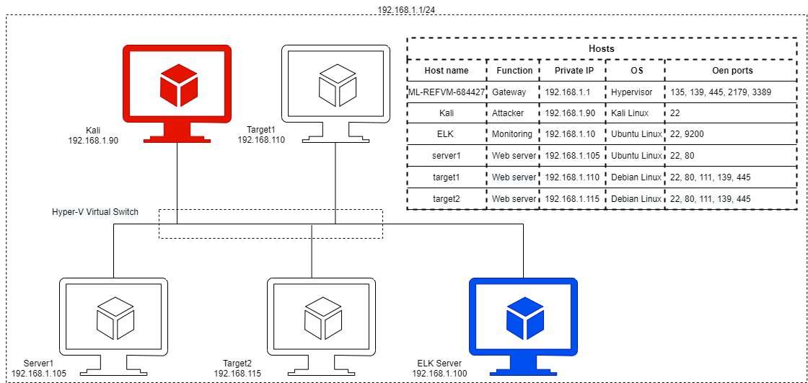

# Blue Team: Summary of Operations

## Table of Contents
- Network Topology
  - Description of Targets
- Monitoring the Targets
- Patterns of Traffic & Behavior
- Suggestions for Going Further

## Network Topology

The Diagram below depicts the network topology of a subnet of `192.168.1.1/24` including an attacker Kali Linux machine an ELK-Stack monitoring system, and a few Linux Ubuntu web servers. The Kali-Linux machine is used to attack vulnerable machines on the network. The diagram below shows the network diagram, the IP addresses, and the functions of each machine. This document reports the the reaction of the current alerts to the attack attack and suggests new alert for a more robust defensive alert.

### Description of Targets
_TODO: Answer the questions below._

The targeted machines are Target 1 (192.168.1.110) and Target 2 (192.168.1.115). Target 1 and 2 are Apache web servers and have SSH enabled, ports 80 and 22 are potential malicous point of entry for attackers.

## Monitoring the Targets

The following alerts were implemented by the SOC analysts.

- Excessive HTTP Errors

    `WHEN count() GROUPED OVER top 5 'http.response.status_code' IS ABOVE 400 FOR THE LAST 5 minutes`

- HTTP Request Size Monitor

    `WHEN sum() of http.request.bytes OVER all documents IS ABOVE 3500 FOR THE LAST 1 minute`

- CPU Usage Monitor

    `WHEN max() OF system.process.cpu.total.pct OVER all documents IS ABOVE 0.5 FOR THE LAST 5 minutes`

Traffic to these services should be carefully monitored. To this end, we have implemented the alerts below:

##### Excessive HTTP Errors

WHEN count() GROUPED OVER top 5 'http.response.status_code' IS ABOVE 400 FOR THE LAST 5 minutes`

Alert 1 is implemented as follows:
  - **Metric**: top 5 `'http.response.status_code'`
  - **Threshold**: over 400
  - **Vulnerability Mitigated**: Brute force and denial of service (DoS) attack
  - **Reliability**: The alert is a good criterium to detect DOS and brute force attacks. The way that the alert work is that it will be triggered by excessive number of `HTTP` request. In contrast to how it names it dones not alert due to the excessive failed `HTTP` request. The threshold depends on the freuency of a website visitor. However, it needs to be tuned frequenlty in case the number visitor of the websites changes. Also it can reliably detect brute force attack as the `HTTP` responses in a brute force attack is very high.

##### HTTP Request Size Monitor

   `WHEN sum() of http.request.bytes OVER all documents IS ABOVE 3500 FOR THE LAST 1 minute`

Alert 2 is implemented as follows:
  - **Metric**: sum of `http.request.bytes`
  - **Threshold**: over 3500 bytes
  - **Vulnerability Mitigated**: Local file inclusion, malicious upload and DoS attack
  - **Reliability**: The alert is suitable for detetion of the uploading any malicous file uploads. However, it can trigger many false alerts including legitimate uploads 

##### CPU Usage Monitor

   `WHEN max() OF system.process.cpu.total.pct OVER all documents IS ABOVE 0.5 FOR THE LAST 5 minutes`

Alert 3 is implemented as follows:
  - **Metric**: maximum OF `system.process.cpu.total.pct`
  - **Threshold**: 50%
  - **Vulnerability Mitigated**: DoS
  - **Reliability**: The attack is suitable for detection of DoS attacks and virus and advare detection

## Patterns of Traffic & Behavior

The only alert that was trigered during the attack was "HTTP Request Size Monitor", which was during the noisy Nmap scan with the `-A` option. The other two alerts was not triggered
The screenshots below show the status of the alerts during the attak.

## Suggestions for alert improvement

The following alerts suggested to avoid undetected future similar attacks. and would be triggered 

Based on the vulnerabilies found and reported by peneteration testing
_TODO_:

## System hardening 
- Each alert above pertains to a specific vulnerability/exploit. Recall that alerts only detect malicious behavior, but do not stop it. For each vulnerability/exploit identified by the alerts above, suggest a patch. E.g., implementing a blocklist is an effective tactic against brute-force attacks. It is not necessary to explain _how_ to implement each patch.

The logs and alerts generated during the assessment suggest that this network is susceptible to several active threats, identified by the alerts above. In addition to watching for occurrences of such threats, the network should be hardened against them. The Blue Team suggests that IT implement the fixes below to protect the network:
- Vulnerability 1
  - Username and password policy
  - **Why It Works**: TODO: E.g., _`special-security-package` scans the system for viruses every day_
- Implementaion of proper access policy
  - **Patch**: TODO: E.g., _install `special-security-package` with `apt-get`_
  - **Why It Works**: TODO: E.g., _`special-security-package` scans the system for viruses every day_
- auditctl and auditbeat
  - Install auditbeat
  - **Why It Works**: TODO: E.g., _`special-security-package` scans the system for viruses every day_
