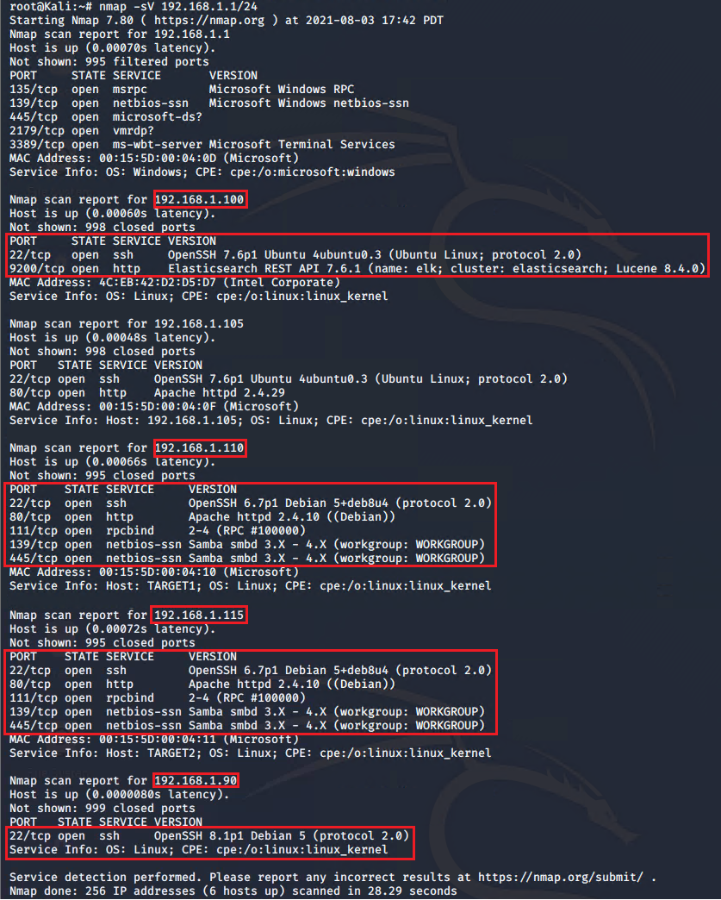
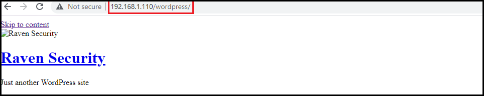
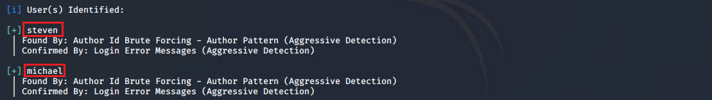

# Red Team: Summary of Operations

## Table of Contents
- Network Topology
- Host Discovery
- Attaking Target 1
    - Exposed Services
    - Critical Vulnerabilities
    - Exploitation

## Network Topology

The Diagram below depicts the network topology of a local subnet of `192.168.1.1/24` including an ELK-stack monitoring , an attaking Kali Linux and a few Linux Ububuntu webservers. The Kali-Linux machine is used to attack vulnerable machines on the network. The diagram below shows the network diagram and the IP addresses and the functions of the machines.

### Scanning and Host Discovery

Nmap is used to scan the `192.168.1.1/24` subnet for host discovery, operating systems detection and identifying open ports and the services running on them to any for  potential exploitation

The folllowing hosts with IP addresses, operating systems, open ports were discovered using 

`# nmap -A -sV 192.168.1.1/24`

| Name      | Function           | IP Address    | Public IP Address | Operating System |
|-----------|--------------------|---------------|-------------------|---------------|
| Jump-Box  | Gateway            | 192.168.1.1   | 125, 129, 445, 2179, 3389     | Linux Ubuntu     |
| Web-1     | Attacker           | 192.168.1.90  | 22    | Kali Linux      |
| ELK-server| Monitoring ELK-Stack server        | 192.168.1.100           | 22, 9200     | Linux Ubuntu     |
| Web-2     | Web server         | 192.168.1.105 | 22, 80     | Linux Ubuntu     |
| Web-3     | Target Web server  | 192.168.1.110 | 22, 80. 111. 139, 445     | Linux Ubuntu     |
| ELK-server| Target Web server  | 192.168.1.115 | 22, 80. 111. 139, 445       | Linux Ubuntu     |

Note: The option `-A` is for operating system detection and service version detection and very verbose, however it is very noisy. The snapshot below shows the exposed services on the machines using `nmap -A -sV 192.168.1.1/24` as it has a shorter output

### Reconnaissance and scanning

All the public webpages on the Target 1 was visited to find any exposed sensitive informatio. Therefore

The screenshot below shows that the web servver uses the WordPress for content management.

`wpscan scanner which include the WordPress vulnerability database is used to enumrate the usernames of the word press by brute forcing the author ID by

`wpscan --url 192.168.1.110/wordpress --enumerate u`

### Exploitation

Two users `michael` and `steven` were discovered.

The first obvious guess for a password would be the same as the user and it appeared to be the case for the user `michael`. Therefore, both the username and the password are `michael`. To secure a user shell into the Target1

`# ssh michael@192.168.1.110`

Looking at the content of the wesite folder `/var/www`

Two flag is found

Two other flags were found in the in `wp_post` table of `WordPress` database. 

Further, exploitable information `wp_users` table of  is found in the `WordPress` database 

To access the SQL database, 

`mysql -u root -p'R@3nSecurity -h localhost'`

`SHOW databases`

`USE wordpress`

`SELECT * FROM wordpress`

To query the content of the databases, 

The password hases of the both `michael` and `steven` users are dound in the 'wp-users'

The password hasesh are dumped into and cracked with the John the Ripper program and with the RockYou word list
_TODO: Fill out the details below. Include screenshots where possible._

The Red Team was able to penetrate `Target 1` and retrieve the following confidential data:
- Target 1
  - `flag1.txt`: _TODO: Insert `flag1.txt` hash value_
    - **Exploit Used**
      - _TODO: Identify the exploit used_
      - _TODO: Include the command run_
  - `flag2.txt`: _TODO: Insert `flag2.txt` hash value_
    - **Exploit Used**
      - _TODO: Identify the exploit used_
      - _TODO: Include the command run_
      
      
      

_TODO: Fill out the information below._

Nmap scan results for each machine reveal the below services and OS details:

192.168.1.1/24

This scan identifies the services below as potential points of entry:
- Target 1
  - List of
  - Exposed Services

_TODO: Fill out the list below. Include severity, and CVE numbers, if possible._

The following vulnerabilities were identified on each target:
- Target 1
  - List of
  - Critical
  - Vulnerabilities

_TODO: Include vulnerability scan results to prove the identified vulnerabilities._