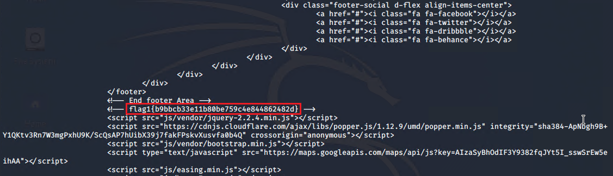
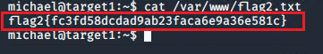
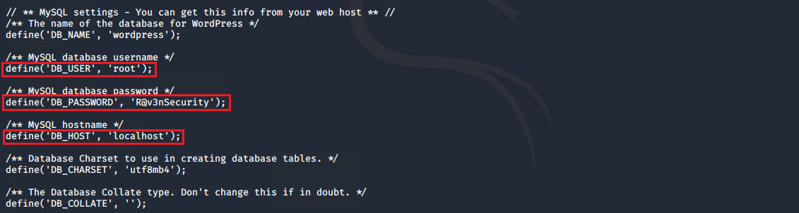
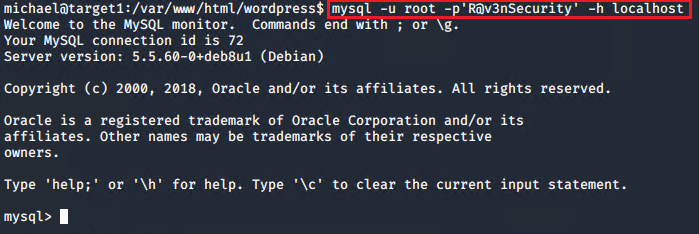
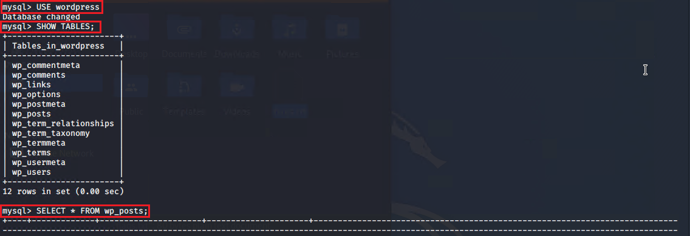
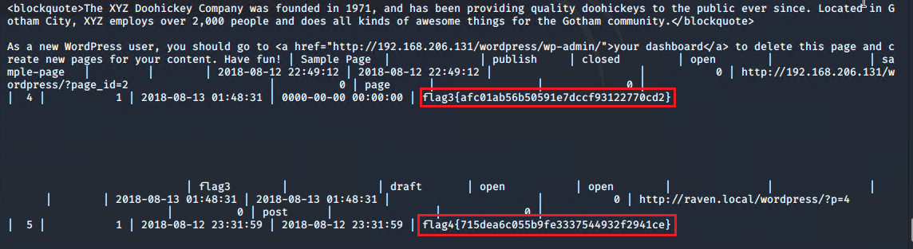
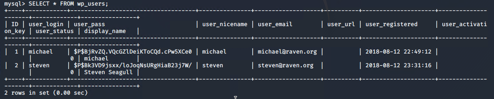
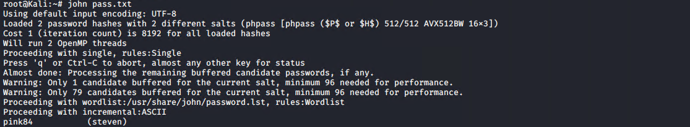
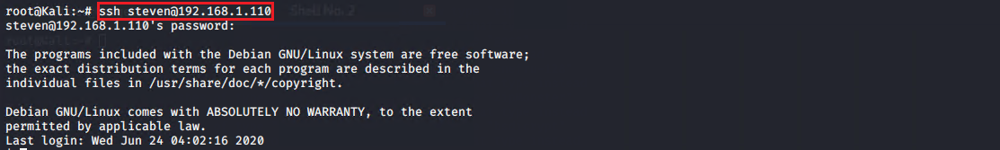
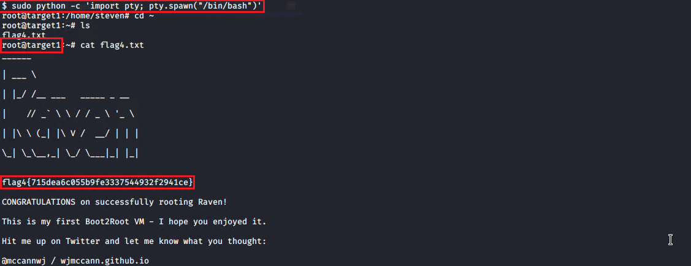

# Red Team: Summary of Operations

This document explains the steps of the attack and reports the vulnerabilities found within the systems.

## Table of Contents
- Network Topology
- Scanning and Host Discovery
- Attacking Target 1
    - Reconnaissance and Scanning
    - Exploitation
    - Vulnerability Assessment
    - Detection Mitigation

## Network Topology

The Diagram below depicts the network topology of a subnet of `192.168.1.1/24` including an attacker Kali Linux machine an ELK-Stack monitoring system, and a few Linux Ubuntu web servers. The Kali-Linux machine is used to attack vulnerable machines on the network. 

## Scanning and Host Discovery

Nmap is used to scan the `192.168.1.1/24` subnet for host discovery, operating system detection, identifying open ports and their exposed services.

The hosts with IP addresses, operating systems, open ports listed in the table shown above were discovered using 

`nmap -A -sV 192.168.1.1/24`

Note: The option `-A` is for operating system detection and service version detection and is very verbose, however it is very noisy. The snapshot below shows the exposed services on the machines using `nmap -sV 192.168.1.1/24` as it has a shorter output.

## Attacking Target 1

### Reconnaissance and Scanning

All the public webpages on the Target 1 were visited to find any exposed sensitive information. The screenshot below shows that the web server uses the WordPress for content management.

`wpscan` scanner that includes the WordPress vulnerability database is used to enumerate the usernames of the WordPress by brute forcing the author ID by

`wpscan --url 192.168.1.110/wordpress --enumerate u`

### Exploitation

Two users `michael` and `steven` were discovered. The first obvious guess for a password would be the same as the username. It appeared to be the case for the user `michael`. Therefore, both the username and the password are `michael`. To secure a user shell in the Target1

`ssh michael@192.168.1.110`

The content of the website folder `/var/www` was investigated and hash values of two flags were found. One located in the `/var/www/html/service.html` while the other in `/var/www/flag2.txt`

The hash value of the flag1 is `b9bbcb33ellb80be759c4e844862482d`

The hash value of the flag2 is `fc3fd58dcdad9ab23faca6e9a3e581c`

The login information to access the database is stored in the `/var/www/html/wordpress/wp-config`

To access the SQL database using `root` as the username, `R@3nSecurity` as the password and `localhost` as the host:

`mysql -u root -p'R@3nSecurity' -h localhost`

To see all the databases

`SHOW databases;`

To use the `wordpress` database and print the content of the `wp_posts`

`USE wordpress;`

`SELECT * FROM wp_posts;`

Two other flags were found in `wp_posts` table of `wordpress` database.

The hash value of the flag3 is `afc01ab56b50591e7dccf93122770cd2`

The hash value of the flag4 is `715dea6c055b9fe3337544932f2941ce`

Exploitable information was found in the `wp_users` table of the `WordPress` database 
The password hash values of the both `michael` and `steven` users are found in the 'wp_users'

`SELECT * FROM wp_users`

The password hashes were dumped into the Kali machine as `pass.txt` and cracked with the John the Ripper program.

`john pass.txt`

The `steven` password found to be `pink84`

Login to the Target 1 machine with 

`# ssh steven@192.168.1.110`

To check the sudo privileges of the user `steven`

`sudo -l`

The user `steven` has the privilege of running Python scripts as the root. To spawn a tty Bash shell

`sudo python -c 'import pty; pty.spawn("/bin/bash")'`

The flag 4 is also printed after spawning the shell.

### Vulnerability Assessment

The following vulnerabilities were found and the Common Weakness Enumeration (CWE) were exploited during the attack

| CWE-| Weakness Description                 | Consequences                           |
|-----|--------------------------------------|----------------------------------------|
| 521 | Weak Password Requirements           | Sensitive Information Exposure         |
| 522 | Insufficiently Protected Credentials | Stolen password, granting a user shell |
| 287 | Improper Authentication              | Stolen password, granting a user shell |

The target runs the Apache 2.4.29 web server and WordPress 4.8.17, which both of them were outdated. There are 29 Common Vulnerabilities and Exposures (CVE) available for the Apache 2.4.29 web server. The list of all vulnerabilities are available in https://httpd.apache.org/security/vulnerabilities_24.html. CVE-2021-26691 and CVE-2019-0211 which result in heap overflow and arbitrary code execution are two examples of the sever vulnerabilities.
The WordPress 4.8.17 vulnerabilities are available in https://www.cvedetails.com/vulnerability-list/vendor_id-2337/product_id-4096/
CVE-2018-19296 is one of the sever vulnerabilities makes this version vulnerable to an object injection attack.

